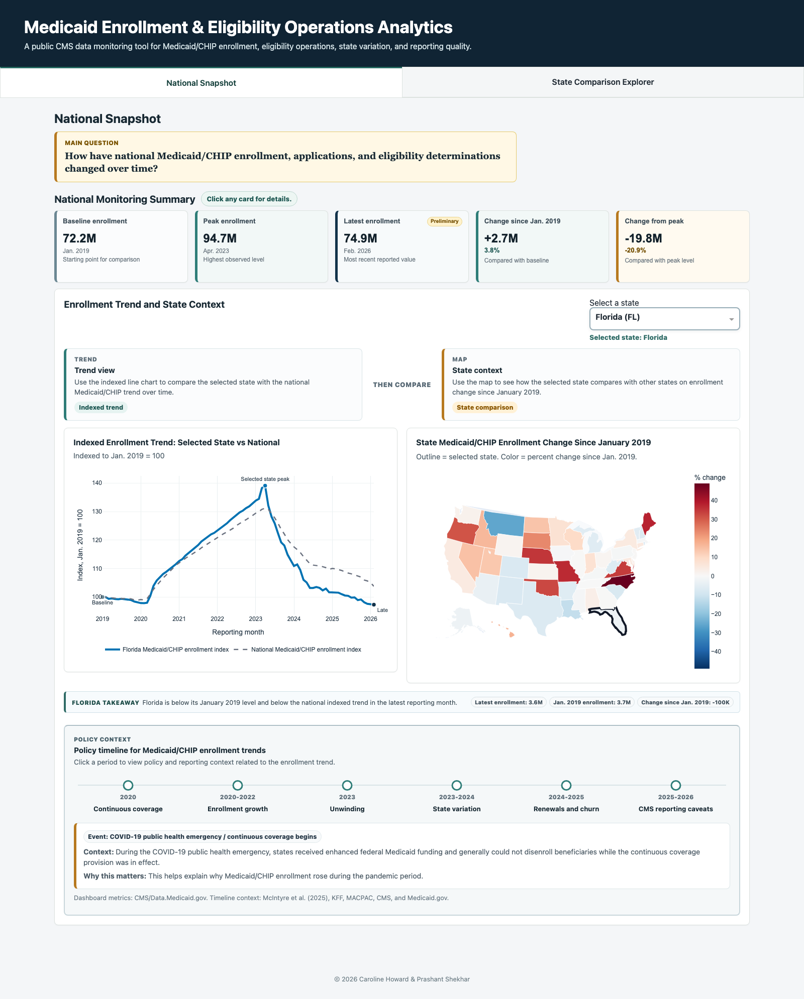
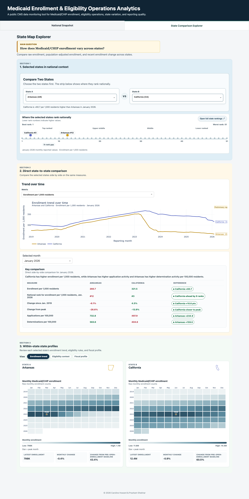

# Medicaid/CHIP Enrollment Divergence After Unwinding

Dashboard and findings brief analyzing Medicaid/CHIP enrollment divergence after unwinding using public CMS data.

Hugging Face Space: https://huggingface.co/spaces/Carolinehoward/medicaid-enrollment-policy-dashboard

Findings brief: [Medicaid/CHIP Enrollment Divergence After Unwinding, 2019-2026](docs/reports/medicaid_chip_enrollment_divergence_findings_brief.pdf)

Repository name: `medicaid-chip-unwinding-analysis`

## Contents

- [Project Purpose](#project-purpose)
- [Official Data Sources](#official-data-sources)
- [Main Questions](#main-questions)
- [Dashboard Overview](#dashboard-overview)
- [Data Pipeline Overview](#data-pipeline-overview)
- [Repository Structure](#repository-structure)
- [Local Run Instructions](#local-run-instructions)
- [Deployment Notes](#deployment-notes)
- [Validation](#validation)
- [Screenshots](#screenshots)

## Project Purpose

Medicaid and CHIP enrollment changes after unwinding can reflect eligibility rules, administrative processes, renewal activity, economic conditions, program design, and reporting practices. This project turns public aggregate Medicaid/CHIP data into a structured dashboard and findings brief for reviewing national retrenchment, Medicaid/CHIP divergence, state comparisons, and state-level profile context.

The dashboard supports descriptive program monitoring and policy-facing reporting. Additional methodological and data caveats are documented in [docs/limitations.md](docs/limitations.md).

## Official Data Sources

Primary CMS/Data.Medicaid.gov source:

- [State Medicaid and CHIP Applications, Eligibility Determinations, and Enrollment Data](https://data.medicaid.gov/dataset/6165f45b-ca93-5bb5-9d06-db29c692a360/data)
- CSV extract used by the ingestion workflow: `https://download.medicaid.gov/data/pi-dataset-may-2026-release.csv`
- Grain: monthly state-level aggregate records
- Dashboard scope: all 50 states plus DC, January 2019 through February 2026

Additional context sources:

- U.S. Census Bureau state population estimates for population-adjusted metrics
- Medicaid.gov State Profiles files for enrollment and eligibility threshold context
- Medicaid.gov MBES/CBES Financial Management Report files for fiscal-year expenditure context
- KFF State Health Facts FMAP/eFMAP files and Medicaid.gov CHIP program structure files retained in `data/context/`

## Main Questions

1. How has national Medicaid/CHIP enrollment changed from January 2019 through the latest reporting month?
2. How do selected states compare with national enrollment patterns and with each other?
3. Which state-level measures are best interpreted as raw counts, rates, shares, or fiscal-year context?
4. What eligibility operations indicators are available from public aggregate reporting?
5. How do reporting limitations and data quality patterns affect interpretation?

## Dashboard Overview

The Plotly Dash app has two top-level sections.

### National Snapshot

The National Snapshot gives an executive-style view of national Medicaid/CHIP enrollment. It includes:

- national KPI cards for baseline, peak, latest enrollment, and change from reference points
- selected-state vs national indexed enrollment trend
- state map context for enrollment change
- policy and reporting timeline for interpreting major enrollment periods

### State Comparison Explorer

The State Comparison Explorer supports a structured two-state workflow. It includes:

- selected-state controls and a national rank strip
- direct state-to-state comparison table
- trend-over-time comparison
- within-state profile tabs for enrollment trend, eligibility context, and fiscal profile

The app uses state-level aggregate records. It does not display county-level, beneficiary-level, claims, utilization, diagnosis, or cost-outcome data.

## Data Pipeline Overview

1. Source ingestion: download official CMS/Data.Medicaid.gov Medicaid/CHIP monthly aggregate data.
2. Cleaning: standardize field names, parse reporting months, standardize state names/abbreviations, and preserve key enrollment and eligibility fields.
3. Validation: check duplicate state-month rows, missingness, latest-month status, and fields with high missingness.
4. Dashboard table build: create national trend tables, state comparison tables, population-adjusted metrics, data quality summaries, and state profile context tables.
5. App rendering: load lightweight CSV outputs from `data/processed/`, `data/manual/`, `data/context/`, and `outputs/dashboard_tables/`.

## Repository Structure

```text
medicaid-chip-unwinding-analysis/
├── app.py
├── Dockerfile
├── requirements.txt
├── assets/
│   └── styles.css
├── data/
│   ├── context/
│   ├── manual/
│   ├── processed/
│   ├── raw/
│   └── data_dictionary.md
├── docs/
│   ├── screenshots/
│   ├── project_brief.md
│   ├── limitations.md
│   ├── source_notes.md
│   └── policy_context.md
├── notebooks/
├── outputs/
│   ├── dashboard_tables/
│   ├── figures/
│   └── policy_summary.md
└── src/
```

## Local Run Instructions

Create and activate a virtual environment, then install dependencies:

```bash
python -m venv .venv
source .venv/bin/activate
pip install -r requirements.txt
```

Run the Dash app locally:

```bash
python app.py
```

Open:

```text
http://127.0.0.1:8050
```

## Deployment Notes

The dashboard is configured for Hugging Face Spaces using the Docker SDK:

https://huggingface.co/spaces/Carolinehoward/medicaid-enrollment-policy-dashboard

Deployment configuration:

- Space SDK: Docker
- app port: `7860`
- app entry file: `app.py`
- server object: `server`
- container start command: `gunicorn app:server --bind 0.0.0.0:7860 --workers 2 --threads 4 --timeout 120`

Runtime paths included for the hosted app:

- `app.py`
- `Dockerfile`
- `requirements.txt`
- `assets/`
- `outputs/dashboard_tables/`
- `data/processed/`
- `data/manual/`
- `data/context/`

`data/raw/` remains outside Git. Raw source files can be re-downloaded or documented, while lightweight processed and dashboard-ready files are included for the hosted app.

## Validation

Validation checks used for this app version:

- `python -m py_compile app.py`
- app import smoke test
- local Dash start check

## Screenshots

### National Snapshot



### State Comparison Explorer


